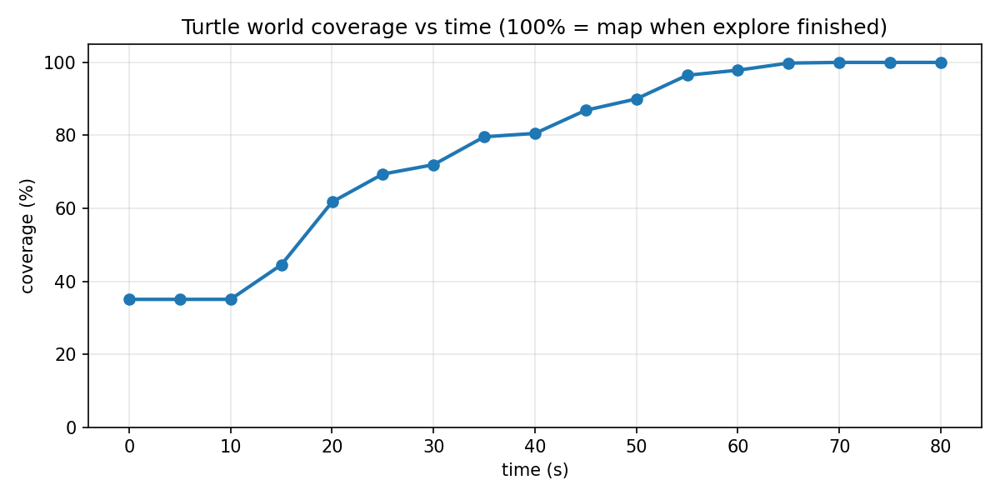

# Swarm Search — Multi-Robot Search & Rescue (ROS 2)

Indoor multi-robot exploration in Gazebo: **three TurtleBot3 Burgers** each run SLAM and Nav2, fuse lidar maps into one team occupancy grid (`/shared_map`), then **autonomously explore** unknown space with frontier detection and greedy goal assignment. Coverage of the turtle world is logged over time for evaluation.

Earlier PyBullet / single-drone experiments live under `archive/` and are not part of the active stack.

## Features

- Namespaced multi-robot bring-up (SLAM + Nav2 + shared `/tf`)
- Live map merge with Gazebo ground-truth alignment → `/shared_map`
- Save / reload a frozen team map; navigate on it with AMCL (TB3_2)
- Frontier detection + greedy multi-robot `NavigateToPose` (`explore_swarm`)
- Coverage-vs-time logging and plot (`analysis/`)

## Stack

| Piece | Choice |
|-------|--------|
| OS | Ubuntu 22.04 (WSL2 tested) |
| Middleware | ROS 2 Humble |
| Sim | Gazebo Classic |
| Robots | TurtleBot3 Burger ×3 |
| Mapping | slam_toolbox (online async) |
| Navigation | Nav2 + Regulated Pure Pursuit (RPP) |
| Shared map | `map_merge_swarm` (GT TF + fuse) |
| Exploration | `explore_swarm` (frontiers + greedy assign) |

## Repository layout

```
swarm-search/
├── launch/                 # Gazebo spawn, SLAM, Nav2, localization
├── nav2_params/            # Per-robot Nav2 configs
├── slam_params/            # Per-robot slam_toolbox configs
├── worlds/                 # Gazebo world
├── maps/                   # Saved team maps (house_shared*)
├── analysis/               # Coverage logger + CSV / plots
├── src/map_merge_swarm/    # Map merge + GT TF nodes
├── src/explore_swarm/      # Frontiers, goal assigner, explore.launch.py
└── archive/                # Old PyBullet phase (not used)
```

## Prerequisites

- ROS 2 Humble desktop
- Gazebo Classic + `turtlebot3` / `turtlebot3_gazebo` / `turtlebot3_navigation2` / `turtlebot3_teleop`
- `slam_toolbox`, `nav2_bringup`, `ros-humble-gazebo-ros-pkgs`
- `python3-matplotlib` (optional, to regenerate the coverage plot)

```bash
export TURTLEBOT3_MODEL=burger
export GAZEBO_MODEL_PATH=$GAZEBO_MODEL_PATH:/opt/ros/humble/share/turtlebot3_gazebo/models
```

## Build

```bash
cd ~/swarm-search
source /opt/ros/humble/setup.bash
export TURTLEBOT3_MODEL=burger
colcon build --packages-select map_merge_swarm explore_swarm
source install/setup.bash
```

Rebuild those packages after you change their source or launch files.

## Run (terminals T0–T9)

Use a **separate terminal** for each block. In **every** terminal first:

```bash
source /opt/ros/humble/setup.bash
source ~/swarm-search/install/setup.bash
export TURTLEBOT3_MODEL=burger
export GAZEBO_MODEL_PATH=$GAZEBO_MODEL_PATH:/opt/ros/humble/share/turtlebot3_gazebo/models
cd ~/swarm-search
```

| Terminal | Role |
|----------|------|
| **T0** | Gazebo + 3 robots |
| **T1–T3** | SLAM (one per robot) |
| **T4–T6** | Nav2 (one per robot; start after that robot’s map TF exists) |
| **T7** | Map merge → `/shared_map` |
| **T8** | RViz |
| **T9** | Autonomous explore (`explore.launch.py`) |

### T0 — Gazebo + three robots

```bash
mkdir -p ~/swarm-search/launch/tmp_sdf
ros2 launch ~/swarm-search/launch/multi_robot_spawn.launch.py use_sim_time:=true
```

Expect a short pause (~8 s) before robots appear. ALSA / sound errors on WSL are harmless.

### T1–T3 — SLAM

```bash
ros2 launch ~/swarm-search/launch/slam_tb3.launch.py \
  robot_ns:=TB3_1 use_sim_time:=true \
  slam_params_file:=$HOME/swarm-search/slam_params/mapper_params_tb3_1.yaml
```

```bash
ros2 launch ~/swarm-search/launch/slam_tb3.launch.py \
  robot_ns:=TB3_2 use_sim_time:=true \
  slam_params_file:=$HOME/swarm-search/slam_params/mapper_params_tb3_2.yaml
```

```bash
ros2 launch ~/swarm-search/launch/slam_tb3.launch.py \
  robot_ns:=TB3_3 use_sim_time:=true \
  slam_params_file:=$HOME/swarm-search/slam_params/mapper_params_tb3_3.yaml
```

Check: `ros2 param get /TB3_1/slam_toolbox map_frame` → `TB3_1/map`.

### T4–T6 — Nav2

```bash
ros2 launch ~/swarm-search/launch/nav2_tb3.launch.py \
  robot_ns:=TB3_1 use_sim_time:=true \
  params_file:=$HOME/swarm-search/nav2_params/burger_tb3_1.yaml
```

```bash
ros2 launch ~/swarm-search/launch/nav2_tb3.launch.py \
  robot_ns:=TB3_2 use_sim_time:=true \
  params_file:=$HOME/swarm-search/nav2_params/burger_tb3_2.yaml
```

```bash
ros2 launch ~/swarm-search/launch/nav2_tb3.launch.py \
  robot_ns:=TB3_3 use_sim_time:=true \
  params_file:=$HOME/swarm-search/nav2_params/burger_tb3_3.yaml
```

### T7 — Map merge

```bash
ros2 launch map_merge_swarm map_merge.launch.py
```

Publishes `/shared_map` in frame `shared_map` (GT TF alignment + merge).

### T8 — RViz

```bash
ros2 run rviz2 rviz2 --ros-args -p use_sim_time:=true
```

- Global Options → Fixed Frame: `shared_map`
- Add → Map → Topic: `/shared_map`
- Optional: PoseArray `/frontiers` or MarkerArray `/frontiers_markers`

### T9 — Autonomous explore

```bash
ros2 launch explore_swarm explore.launch.py
```

Starts frontier detection and greedy multi-robot goal assignment.

### Optional — teleop one robot

```bash
ros2 run turtlebot3_teleop teleop_keyboard --ros-args -r __ns:=/TB3_1
```

### Optional — load the frozen team map

```bash
ros2 run nav2_map_server map_server --ros-args \
  -p yaml_filename:=$HOME/swarm-search/maps/house_shared.yaml \
  -p use_sim_time:=true \
  -p frame_id:=shared_map

ros2 lifecycle set /map_server configure
ros2 lifecycle set /map_server activate
```

For AMCL + Nav2 on that map (TB3_2), use `launch/nav2_tb3_localization.launch.py` and `nav2_params/burger_tb3_2_loc.yaml` (do not run SLAM on TB3_2 at the same time).

## Coverage vs time

Example result from a full explore run (100% = known cells when the turtle world was fully mapped; the shared canvas is larger than the world, so raw canvas fill stays lower):



### Reproduce the graph

With **T0–T7** running, start the logger, then **T9**:

```bash
# Terminal A — logger
cd ~/swarm-search/analysis
python3 coverage_logger.py
```

```bash
# Terminal B — explore (if not already on T9)
ros2 launch explore_swarm explore.launch.py
```

Let the robots finish the map, then **Ctrl+C** the logger. Plot (normalizes so the final known cell count is 100%):

```bash
cd ~/swarm-search/analysis
python3 - <<'PY'
import csv
from pathlib import Path
import matplotlib.pyplot as plt

rows = list(csv.DictReader(Path("coverage.csv").open()))
known = lambda r: int(r["free"]) + int(r["occupied"])
k_end = known(rows[-1])
t0 = float(rows[0]["wall_time"])
t = [float(r["wall_time"]) - t0 for r in rows]
y = [100.0 * known(r) / k_end for r in rows]

plt.figure(figsize=(8, 4))
plt.plot(t, y, marker="o", linewidth=2)
plt.xlabel("time (s)")
plt.ylabel("coverage (%)")
plt.title("Turtle world coverage vs time")
plt.ylim(0, 105)
plt.grid(True, alpha=0.3)
plt.tight_layout()
plt.savefig("coverage_pct.png", dpi=150)
print("saved coverage_pct.png")
PY
```

## Notes

- Start Nav2 only after that robot’s `TB3_N/map` TF exists, or the global costmap will time out.
- Do not run an old standalone `static_map_tfs` launch together with `map_merge.launch.py` (duplicate TFs).
- Kill leftover Gazebo before relaunching: `pkill -9 gzserver; pkill -9 gzclient`
- Gazebo models must be `burger_*` (set `TURTLEBOT3_MODEL=burger`) for GT map TFs.

## Future work

- Limited-range communication for map sharing
- Aerial scout + object query / detection
- Richer assignment (e.g. information gain) and inter-robot collision awareness

## License

MIT
